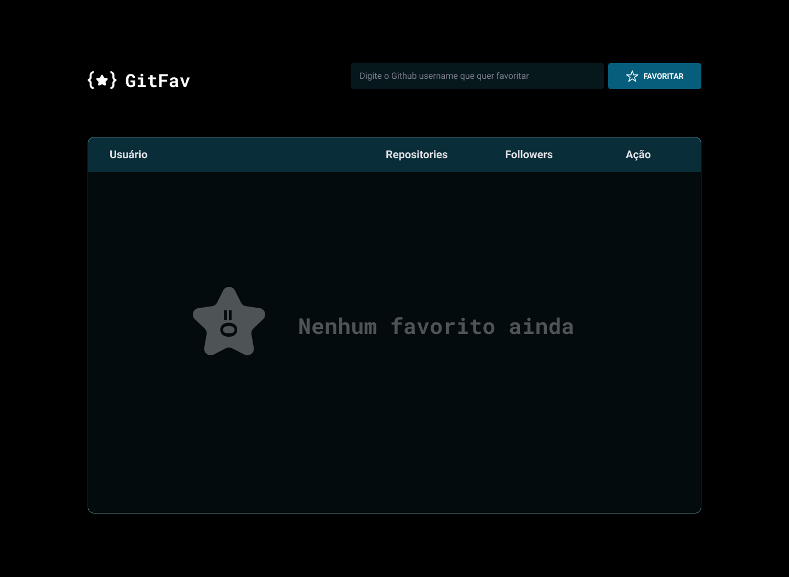
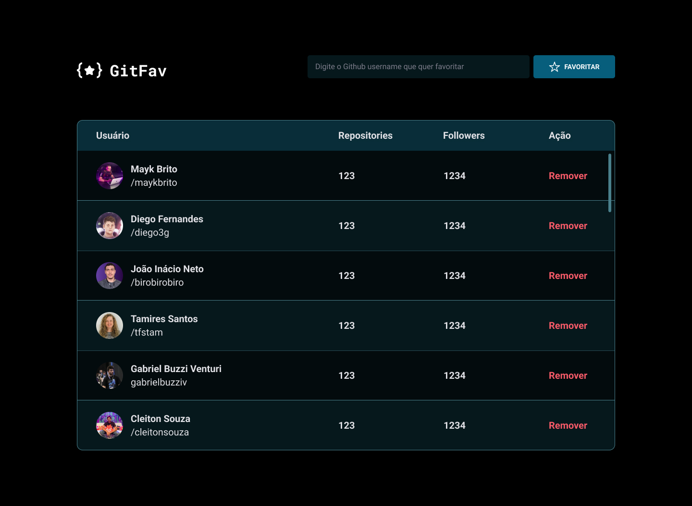

<h1>GitFav</h1>

 

<h2> O Projeto </h2>

O projeto foi desenvolvido como desafio do curso Explorer da Rocketseat. 
 

 Ele é um aplicativo para salvar os usuários favoritos do GitHub.

  

 

  

 

informações básicas que o usuário deve seguir para usar o GitFav:

- Funcionalidades da aplicação:
  - input: faz a pesquisa através do nome de usuário do github;
  - O usuário salvo é mostrado no campo de favoritos.

 

- Funcionalidades dos botões:
  - Favoritar: favorita o usuário;
  - Remover: remove o usuário.

 

Quer conferir o Git Fav? 

[Visite o projeto online](https://gitfav-explorer.netlify.app/)

 

<h2> O intuito do projeto </h2>

O intuito do projeto foi colocar em prática os conhecimentos acerca de:

- HTML
- CSS
  - variáveis
  - position/ grid/ flex/ margin
  - align-self / justify-self / justify-content
  - ::before / :hover

- JavaScript
  - Assincronismo
  - Promises
  - Classes
  - heranças
  - localstorage
  - fetch()
  - GitHub API
  - Async functions
  - try, catch e throw

 

<h2> Tecnologias </h2>

Foi utilizado as seguintes tecnologias para desenvolver esse projeto:

- HTML
- CSS
- JavaScript
- Git
- GitHub